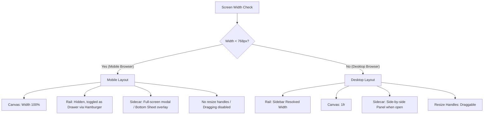
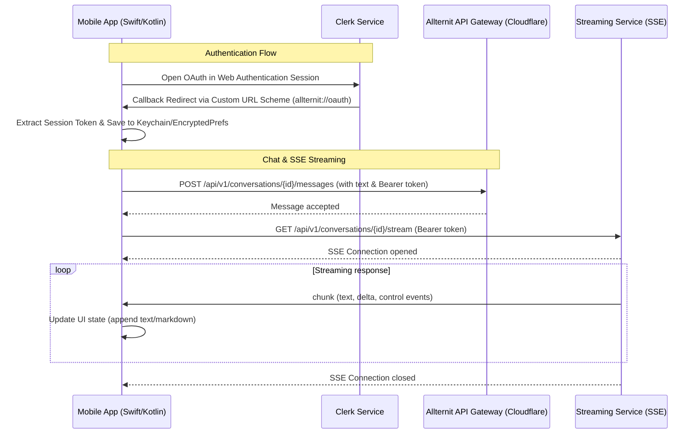

# Web Browser Optimization + Native App Track Roadmap

Status: APPROVED ROADMAP — Mapped 2026-07-17
Scope: 
- **Web Surface:** `surfaces/ai.allternit.com` (Vite SPA) deployed to Cloudflare Pages as `allternit-platform` (`platform.allternit.com`).
- **Mobile Surface:** Brand-new native client repositories or modules (`surfaces/allternit-ios` and `surfaces/allternit-android`).

---

## 🎯 Executive Summary
The Allternit platform is evolving into a cross-device experience. This roadmap details the concrete phases required to:
1. **Optimize the Web Platform (Vite/Tailwind CSS):** Redesign and polish the visual canvas, sidebars, sidecars, and layout structures to look gorgeous and function seamlessly on both desktop browsers and mobile web viewports.
2. **Build Native Mobile Applications (iOS & Android):** Establish native architectures in Swift (SwiftUI) and Kotlin (Jetpack Compose) with full platform parity, targeting the seamless user experience, stream-based chat, and interactive artifacts found in the Claude mobile application.

---

## 🗺️ Responsive Layout Strategy (Web Browser)

The current web platform layout relies on rigid desktop grid dimensions (sidebar rail and sidecar panels with absolute widths and resize handles). To support mobile web browsers cleanly, the layout grid must adapt dynamically to the viewport size.

---

## 📦 Track 1 — Web Browser Mode Responsive Tweak

### Phase W1 — Core Responsive Layout Grid (ShellFrame Refactor)
- [ ] **Breakpoints & Media Queries:** Update `ShellFrame.tsx` to query screen dimensions (via React hooks or `@media` Tailwind queries) and dynamically switch layouts.
- [ ] **Mobile Sidebar Rail (Drawer Mode):**
  - On mobile (`width < 768px`), hide the `ShellRail` by default.
  - Add a hamburger menu toggle to the top navigation header.
  - Render the `ShellRail` inside a slide-out drawer (`position: fixed; left: 0; top: 0; bottom: 0; width: 280px; z-index: 150;`) using Framer Motion for smooth transitions and a dark backdrop screen.
- [ ] **Mobile Sidecar Panel (Overlay Mode):**
  - Displace side-by-side sidecar rendering on mobile viewports.
  - Implement a sliding bottom sheet or a full-width overlay drawer for `ArtifactSidecar`.
  - Add a dedicated navigation header in the sidecar to allow collapsing it back to the canvas.
- [ ] **Disable Grip Resizing on Mobile:** Hide the `ResizeGrip` handles and discard dragging logic when mobile viewports are active.

### Phase W2 — Component Aesthetics & Touch Target Optimization
- [ ] **Composer Refactor:**
  - Redesign the chat inputs, attachments buttons, and send triggers to adapt to small screens.
  - Use `env(safe-area-inset-bottom)` to account for mobile Safari and Chrome browser address bars/home indicators.
- [ ] **Touch Targets:** Audit all buttons and navigation tabs to ensure minimum clickable sizing of 44x44px.
- [ ] **Chat View Layout adjustments:**
  - Reduce side paddings on chat messages (`px-4` on desktop to `px-2` on mobile).
  - Shrink the code blocks and markdown content containers appropriately.
  - Enable smooth horizontal scrolling (`overflow-x-auto`) for code snippets and data tables.
- [ ] **Electron-feature Gating:** Make sure Electron-specific controls (e.g. desktop streaming permissions, native filesystem indicators) degrade gracefully or hide entirely when loaded in plain browsers.

---

## 📱 Track 2 — Native Mobile Applications (iOS & Android)

To achieve native parity comparable to the Claude mobile app, Allternit will utilize native Swift (SwiftUI) for iOS and native Kotlin (Jetpack Compose) for Android.

### Phase A1 — iOS Native Client (SwiftUI)
- [ ] **Project Setup:** Initialize `surfaces/allternit-ios` Xcode project with SwiftUI, targeting iOS 16+.
- [ ] **Authentication Integration (Clerk):**
  - Integrate `ASWebAuthenticationSession` to trigger authentication.
  - Set up a custom URL scheme (e.g., `allternit://auth-callback`) in Xcode to capture redirects.
  - Implement Keychain services to store jwt access/refresh tokens securely.
- [ ] **Networking & SSE Parsing:**
  - Implement custom API clients using Swift concurrency (`async/await`).
  - Set up a streaming parser using `URLSession` to process Server-Sent Events (SSE) line-by-line for chat completions.
- [ ] **SwiftUI Chat Layout:**
  - Build a high-performance chat rendering interface with native autogrowing text editors.
  - Implement native markdown parsing utilizing package libraries like `MarkdownUI` or `Markdown` with custom code block syntax highlighting.
- [ ] **Sidecar / Artifact Navigation:**
  - Implement a split-pane layout for iPads and a slide-over/full-screen detail page for iPhones to display artifacts (documents, interactive scripts, code previews).
  - Use native web views (`WKWebView`) to execute sandboxed HTML/SVG previews of artifacts if required.

### Phase A2 — Android Native Client (Kotlin + Jetpack Compose)
- [ ] **Project Setup:** Initialize `surfaces/allternit-android` Gradle project targeting SDK 33+.
- [ ] **Authentication Integration (Clerk):**
  - Configure Chrome Custom Tabs to run Clerk oauth flows.
  - Define custom intent filters in `AndroidManifest.xml` to handle redirect URIs.
  - Store tokens securely using Android Jetpack Security (`EncryptedSharedPreferences`).
- [ ] **Networking & SSE Parsing:**
  - Configure OkHttp and Retrofit for standard API endpoints.
  - Implement Kotlin Coroutines and `Flow` to stream SSE responses from the `/api/v1/conversations/{id}/stream` endpoint.
- [ ] **Compose Chat Layout:**
  - Build a chat bubble feed using `LazyColumn` for high performance lists.
  - Render Markdown and highlights using Compose-compatible rendering blocks (like `Compose Rich Text` or a customized `TextView` backed by `Markwon`).
- [ ] **Sidecar / Artifact Navigation:**
  - Use Navigation Drawers and Bottom Sheets (`ModalBottomSheetLayout`) to overlay artifacts.
  - Wrap artifact scripts inside sandboxed Android `WebView` containers.

### Phase A3 — API Sync & Platform Parity Checklist
- [ ] **Shared API Signatures:**
  - **Conversations API:** Fetch history list, retrieve individual threads, and support conversation branching (`/fork` endpoints).
  - **Models Config:** Synchronize active agent profiles and system prompts.
- [ ] **Media & Assets Upload:**
  - Implement native camera and gallery pickers (using PhotosPicker on iOS and ActivityResultContracts on Android).
  - Support multi-part uploads directly to Cloudflare Pages/R2 storage endpoints.
- [ ] **Realtime Syncing:** Keep chat messages in sync by implementing lightweight polling or WebSocket channels for live configuration changes.

---

## 📆 Timeline and Phasing

| Phase | Title | Objective | Target |
| :--- | :--- | :--- | :--- |
| **Phase 1** | Web Responsive Refactor | Adapt layout grids, compose elements, and optimize touch targets for mobile browsers. | 1.5 Weeks |
| **Phase 2** | Native Mobile Scaffolding | Set up Xcode/Gradle boilerplates, integrate Clerk Auth redirection and secure storage. | 2 Weeks |
| **Phase 3** | Core Chat & Stream Engine | Implement native networking, SSE parsers, and custom chat layouts. | 2.5 Weeks |
| **Phase 4** | Sidecar & Artifact Parity | Integrate WebView sandboxes, full-screen artifact overlays, and SVG/code views. | 2 Weeks |
| **Phase 5** | Branching & Settings | Add support for branching conversations, user profiles, and environment selection. | 1.5 Weeks |
| **Phase 6** | QA, Polish & Release | Conduct visual testing, perform app performance tuning, and submit to stores. | 1.5 Weeks |

---

## 🛠️ Verification & Test Strategy

1. **Responsive Web Browsers:**
   - Test in Chrome/Safari mobile responsive modes.
   - Run tests on physical iOS Safari and Android Chrome devices to ensure dynamic address bar changes do not break composer heights.
2. **Native Applications:**
   - Execute unit tests for SSE parsers.
   - Run integration checks validating token refreshes.
   - Validate UI flows using iOS Simulator (various screen ratios) and Android Emulator (various API versions).
